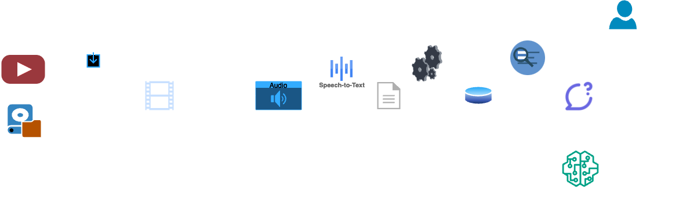

# VidTalk


A chatbot that allows to chat with youtube videos and local videos file. The image above shows examples of this bot on [this video](https://www.youtube.com/watch?v=9RhWXPcKBI8). 

[](https://www.youtube.com/watch?v=9RhWXPcKBI8)

## Objective
This project aims to enhance user experience by developing an AI-powered chatbot that provides insights into video content. The chatbot accepts MP4 videos or YouTube links as input and answers queries about the video content. Leveraging advanced AI techniques, the chatbot allows users to search and navigate specific moments in a video, transforming the way users interact with video content.

## How to run
``` bash
$ # create your own environments
$ cd ${this_root_folder_contains_this_README}
$ pip install -r requirements.txt
$ python main.py "path_of_youtube_video_you_want"
```

## Pipeline 


Our pipeline is designed to accept two types of inputs: a YouTube video link or a local file path. In the case of a YouTube video, the video is downloaded and saved in local storage. For local files, we directly utilize the provided video path.

The subsequent step involves extracting audio from the video. Utilizing Automatic Speech Recognition (ASR) or Text-to-Speech (TTS) technology, we transcribe the audio content from the video. This transcription is then segmented into chunks.

Following this, another model or service calculates the embeddings for each chunk. These embeddings, along with the original text, are stored in a database for future reference.

When a user poses a question, we leverage the aforementioned database to construct a dynamic context and formulate a prompt for their query. A Language Model (LLM) then generates an answer to this question, which is relayed back to the user.

This process is iterative and can be repeated as many times as the user wishes to ask questions.

## Further works
- Eliminate repetitive tasks to decrease the duration of the procedure.
- Enhance the data retrieval process for efficiency.
- Clear the cache upon the completion of each session.
